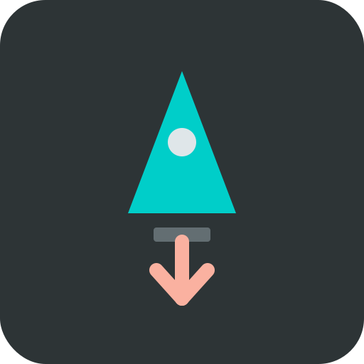

Created by **EIZZO**

---

### 🌟 Overview
**EIZZOs-Launchers** is a high-performance utility plugin designed for Minecraft 1.21.1+ that transforms standard blocks into powerful, customizable launch pads. Whether you're building a lobby parkour course, a fast-travel hub, or a boat-racing circuit, this plugin provides the tools to create seamless and thrilling movement mechanics.

---

### 🚀 Key Capabilities

#### 1. **Precision Launch Mechanics**
- **Dual-Axis Control:** Independently configure **Vertical** (height) and **Horizontal** (distance) velocity.
- **Directional Awareness:** Launches follow the entity's looking direction for a natural movement feel.

#### 2. **Professional Visuals & Audio**
- **Dual Launch Particles:** Spawn two independent particle effects (e.g., Flame and Cloud) at the moment of launch.
- **Parallel Foot Trails:** Dynamic particles follow the player's feet (or boat sides) while in the air, creating a professional "streak" effect.
- **Dynamic Soundscape:** Customizable sound effects provide immediate auditory confirmation.

#### 3. **Advanced In-Game Editor**
- **Clean 45-Slot Layout:** Organized GUI with power controls, boat toggles, and dedicated effect columns.
- **Live Adjustments:** Tweak power levels or cycle through "Nice" presets for both launch and trail effects.
- **Item-to-Block Binding:** Simply hold a block in your hand to register it as a new launcher type.

#### 4. **Smart Persistence**
- **Intelligent Trails:** Trails automatically stop when the player lands on a block, hits water, or enters lava.
- **Reliable Launching:** Integrated grace-period logic ensures effects trigger every single time, even on rapid subsequent launches.

---

### 🛠 Technical Details

#### **Command Management**
The plugin features a robust command system with full tab completion for all properties.
- **Set Property:** `/launchers set <material> <property> <value>`
- **Properties:** `vertical`, `horizontal`, `boat`, `particle1`, `particle2`, `trail_particle1`, `trail_particle2`, `sound`.

---

### 📋 Commands & Permissions

| Command | Action | Permission |
| :--- | :--- | :--- |
| `/launchers` | Opens the Management GUI | `eizzolaunchers.admin` |
| `/launchers set ...` | Modifies launcher properties | `eizzolaunchers.admin` |
| `/launchers reload` | Reloads the configuration | `eizzolaunchers.admin` |

**Aliases:** `/launcher`, `/el`

---

### 💾 Configuration Example
```yaml
config-version: 1.1
launchers:
  GOLD_BLOCK:
    vertical: 50.0
    horizontal: 50.0
    boat: true
    particle1: FLAME
    particle2: CLOUD
    trail_particle1: SOUL_FIRE_FLAME
    trail_particle2: WHITE_ASH
    sound: ENTITY_FIREWORK_ROCKET_LAUNCH
```

---
*Developed with a focus on performance and player experience.*
